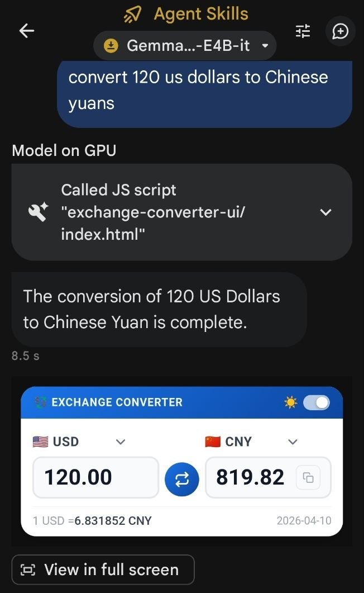

<div align="center">

# 💱 Exchange Converter UI — AI Edge Skill

[](https://github.com/victoralv/exchange-converter-ui/releases)
[](https://ai.google.dev/edge)
[](https://github.com/google-ai-edge)
[](LICENSE)
[](SKILL.md)
[](https://github.com/victoralv/exchange-converter-ui)

**A real-time currency & crypto converter skill for Google AI Edge Gallery.**  
Powered by **Gemma 4** running locally on your device. Results appear as an **interactive webview card** — change amounts, switch currencies, all without leaving the chat.

[📋 SKILL.md](SKILL.md) · [🐛 Report an Issue](https://github.com/victoralv/exchange-converter-ui/issues)




</div>

---

## 🏆 Why Exchange Converter UI?

| Feature | Calculator Apps | Web Converters | **Exchange Converter UI** |
|---|:---:|:---:|:---:|
| Natural language input | ❌ | ❌ | ✅ |
| Interactive webview card | ❌ | ❌ | ✅ |
| Change currencies inside card | ❌ | ❌ | ✅ |
| Crypto + Fiat in one tool | ❌ | ⚠️ | ✅ |
| Works 100% offline (cached) | ❌ | ❌ | ✅ |
| No cloud / No tracking | ❌ | ❌ | ✅ |
| Dark mode with persistence | ❌ | ⚠️ | ✅ |
| Runs on-device with Gemma 4 | ❌ | ❌ | ✅ |

---

## ✨ Key Features

- **Interactive Webview Card** — Results are displayed as a rich UI card embedded in the chat. Edit the amount, pick a different source or destination currency — all inline, no new screen.
- **Currency Selectors with Flags** — Both coins show flag emojis (🏳 for crypto, country flags for fiat) in grouped dropdowns (Fiat / Crypto). Changing either triggers a live rate re-fetch.
- **Dark Mode Toggle** — A 🌙/☀️ toggle in the card header switches the background to dark. Preference is persisted in localStorage across sessions.
- **Fiat & Crypto Support** — 37 fiat currencies (USD, EUR, GBP, JPY, MXN…) and 13 cryptocurrencies (BTC, ETH, SOL, DOGE, ADA…) available in the selectors.
- **Offline-First Architecture** — Rates are cached locally after the first fetch. No internet? Cached rates kick in automatically with an ⚠ Offline indicator.
- **Live Exchange Rates** — Fetches real-time rates from two redundant APIs with automatic failover. Rate date shown in the card footer.
- **Copy to Clipboard** — A copy button appears on the result field after conversion, letting users copy the value instantly.
- **Zero Data Collection** — Everything runs on-device via Gemma 4. No data leaves your phone.

---

## 🔧 How It Works

Exchange Converter UI is a **Skill** for the [Google AI Edge Gallery](https://github.com/google-ai-edge) app, designed to run with the **Gemma 4 E4B-it** model locally on Android/iOS devices.

```
User prompt ──► Gemma 4 (on-device) ──► Parses amount & currencies
                                          │
                                          ▼
                                    run_js (index.html)
                                          │
                              ┌───────────┴───────────┐
                              ▼                       ▼
                        Live API fetch          Local cache
                        (when online)         (when offline)
                              │                       │
                              └───────────┬───────────┘
                                          ▼
                                  Webview card opens:
                               assets/webview.html?...
                                          │
                                          ▼
                          Interactive card shown in chat
                       (editable amount, currency selectors,
                            dark mode, copy button)
```

1. **You speak naturally** — "Convert 100 dollars to euros" or "How much is 1 BTC in JPY?"
2. **Gemma 4 parses your request** — The on-device LLM extracts the amount, source currency, and target currency from your message.
3. **JavaScript engine executes** — The skill calls `run_js` with structured JSON. The embedded script fetches live rates (or uses cached ones) and builds a URL for the webview.
4. **Webview card renders** — An interactive card appears in the chat pre-filled with the result. The user can adjust the amount or swap currencies without asking again.

---

## 🚀 Installation

### Option 1: Import from URL (Recommended)
1. Open **Google AI Edge Gallery** on your Android/iOS device.
2. Tap **Agent Skills** → **Add Custom Skill** → **From URL**.
3. Paste this URL:
```
https://github.com/victoralv/exchange-converter-ui
```
4. Confirm. The skill will load and activate **Exchange Converter UI v2.0.0**.

### Option 2: Clone locally
```bash
git clone https://github.com/victoralv/exchange-converter-ui.git
```
Point AI Edge Gallery to the local folder (see app documentation).

---

## 💬 Usage Examples

> Just talk to the agent naturally. Here are some examples:

**🔄 Convert Currencies**
- `"100 USD to EUR"`
- `"How much is 50 euros in Japanese yen?"`
- `"500 MXN to dollars"`

**₿ Convert Crypto**
- `"Convert 0.5 BTC to USD"`
- `"How much is 1 ETH in EUR?"`
- `"1000 DOGE to GBP"`

---

## 🖼 Webview Card

The card renders inline in the chat and includes:

- **Flag + currency code selector** (top of each column) — tap to switch to any of the 50 supported currencies
- **Editable amount input** (left) — type a new amount and hit Convert
- **Circular convert button** (center) — triggers recalculation using the stored rate
- **Result display** (right) — shows the converted amount; copy button appears after conversion
- **Rate row** (bottom) — shows `1 XXX = Y.YYYYYY ZZZ`, date, and ⚠ Offline pill when on cached rates
- **Dark mode toggle** (header, top-right) — 🌙 / ☀️ icon with a slide toggle; state persists across sessions

---

## 🗂 Repository Structure

```text
exchange-converter-ui/
├── SKILL.md              # Skill definition & LLM instructions
├── README.md             # This file
├── scripts/
│   └── index.html        # JS engine: rate fetching, caching, webview URL builder
└── assets/
    └── webview.html      # Interactive conversion card UI
```

---

## 🗺 Roadmap

- [x] v1.0 — Fiat + Crypto conversion with live rates
- [x] v1.0 — Offline cache with automatic failover
- [x] v1.0 — Multi-API redundancy
- [x] v2.0 — Interactive webview card with editable fields
- [x] v2.0 — Currency selectors with flag emojis (Fiat + Crypto groups)
- [x] v2.0 — Dark mode with localStorage persistence
- [x] v2.0 — Copy to clipboard button
- [ ] v2.1 — Historical rate comparison ("USD to EUR last week")
- [ ] v2.2 — Multi-currency output ("100 USD in EUR, GBP, JPY")

---

## 🤝 Contributing

Contributions are welcome! Open a Pull Request or file an Issue on [GitHub](https://github.com/victoralv/exchange-converter-ui).

---

<div align="center">
<sub>Built for offline Gemma-4-E4B-it inference on Google AI Edge Gallery · 100% private · No data leaves your device</sub>
</div>
